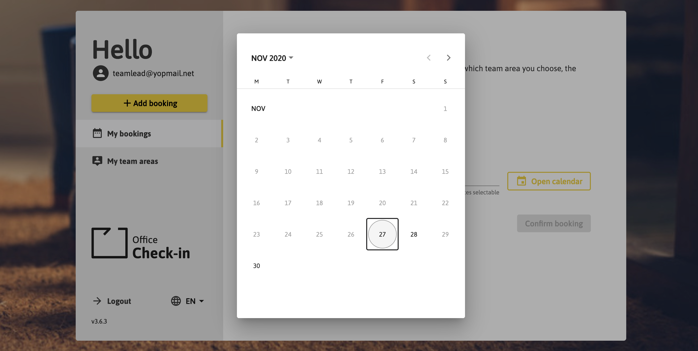

# Welcome to Office Check-In 

**With the Office Check-In Application employees can book a day at the office. The App tracks occupancy of the team areas and holds presence below the threshold.**

## Registration

Register here with your E-Mail and Password

If you are a member of a team, please register as a “Team member”. If you are a “Team manager“ and need the role in order to create team areas please register as a Team manager. 

You will receive a registration confirmation mail.

## Step Sign In

You can now sign Into the Office Check-In Tool with your E-Mail address and password

## Create new team areas 

If you are a team manager, then you are able to create new team areas for your office area by clicking the link “My Areas” in the sidebar. 

Create your team by inputting a unique name, the maximum office capacity and address. 

After you have created the area you can now invite your team members by sharing the join link via E-Mail or other communication channels. 

**Note: the users who join the team must be logged into the tool in order to join the team.**

## Join a Team Area

To be able to join a team area you need to own the „join link“ for the team area.  

The join link can only be provided by a Team Manager. Please copy and paste the join link into your Browser. 

Next you will be required to log in into the Office Check-in App. Then you can join the team area. 

**Note**: in some cases you are required to paste the join link again into your browser in order to be able to join.  

## Add new Booking

If you would like to go to your office on a desired day you can book here your day at the office.

First, choose the team area you will go to:

Second, choose the date you want to book:

Your booking is now successfully saved:

You can then see your booked office day at "My bookings":

